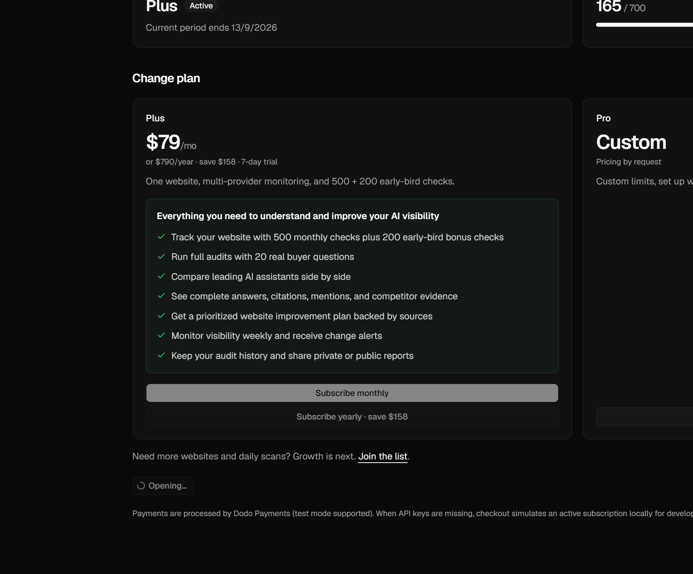
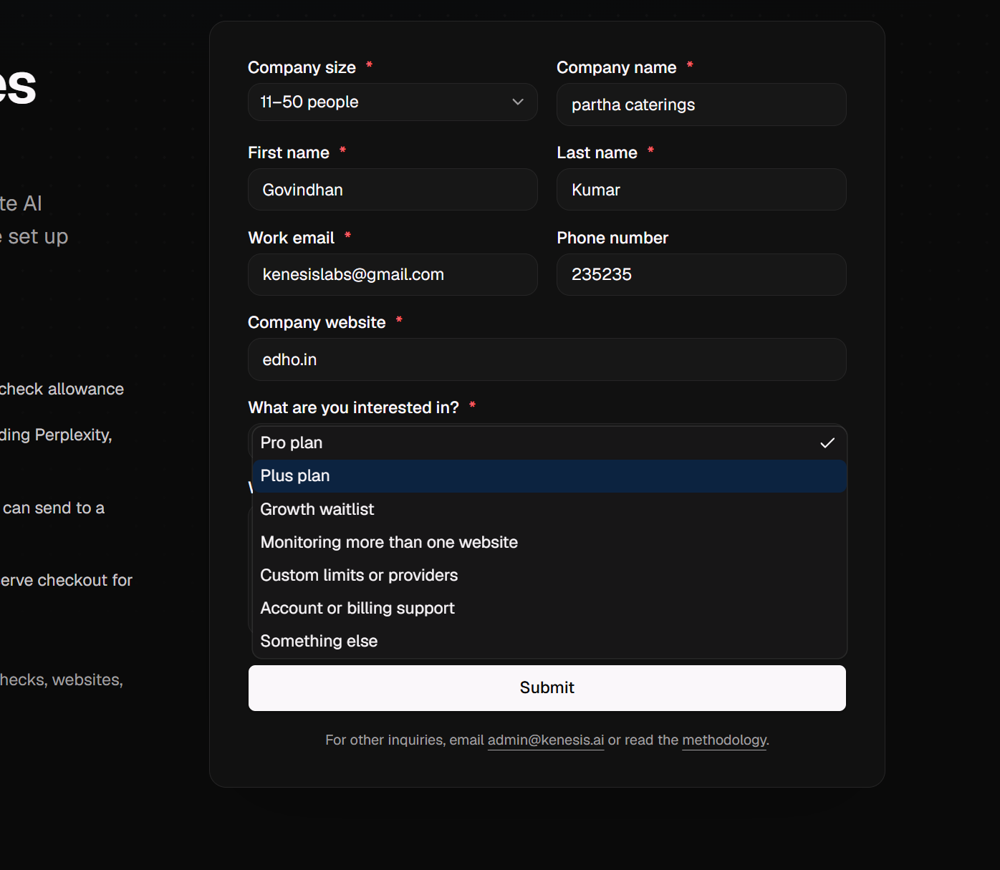
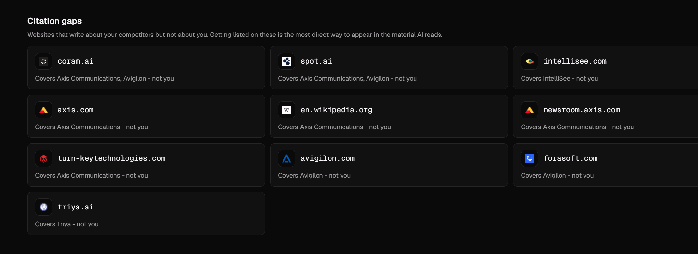
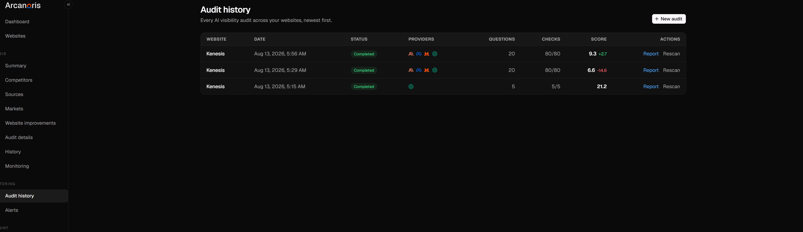

ISSUES:

* Inside the billing tab , when I click the manage subscriptions button ,which redirects me to other page , and when I come back to old page ...still the button which ive clicked is loading and stops only when I reload the page .

* In contact us page we are giving an option to choose the "What you are interested in " ...options inside those are meaningless , we have the plus plan already in the billing but its showing that again .Also many options are there which we are not offering in the product .

* There is a button called "Make report public" which we aint using and needed to be removed .

* " Executive verdict " term in the summary page looks like AI word , so if removed or change to something better would suite.

* In sources page we have heading citation gaps , under which we are showing links that mentioned competitors but its actual links is given under "Mentions across the internet ".User would expect to see a link right near the place where they see citation gaps ... but we are hiding the links under the " Mention across... " heading . Find a solution for this , either to group altogther or add a disclaimer about where the data is .

* We dont need the correction of the questions in the audit details page cause if we edit the question directly there ... the future audit details page of the same audit would reload with the new question and old answer ! Which is misleading , So we have an option to chose questions from older audits and change if needed , users cna do that there if needed . So we shall remove it .

* If a user generated two audits for a website , he/she cannot see the older audits and can see only the recent audit ... Even in audit history if the report for older audit is clicked ... it is redirected to the recent audit !

* As of now lets remove the market option in the monitoring page , cause we need to change some which causes delay in deployment.
